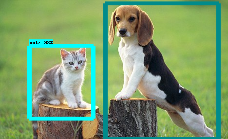
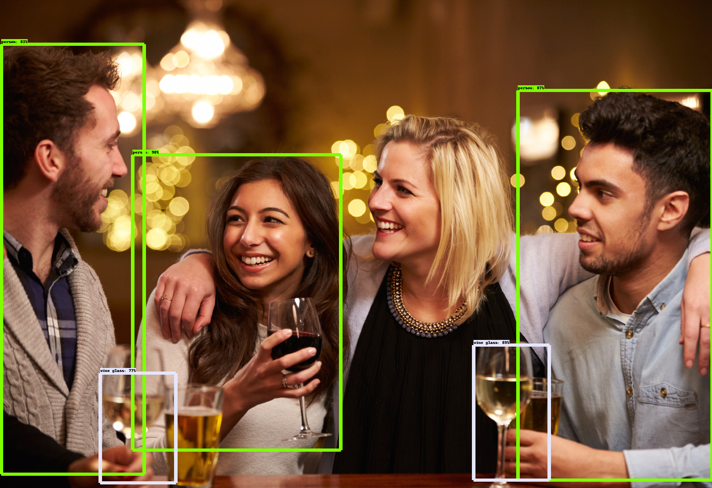

# README #

### Object Detection API
This is an object detection Web Application and API used to identify various objects in images along with % accuracy.
It can also be used to identify the various objects present in a short video.

Used `Python`, `Flask`, `Tensorflow` and pre-trained tensorflow models for the application and configured Apache web server to run the application.

******

 <b> Sample Results </b>

******

 <b> Image Results </b>

  
&nbsp; &nbsp; &nbsp; &nbsp;
  
&nbsp; &nbsp; &nbsp; &nbsp;

 <b> Video Results </b>

  
&nbsp; &nbsp; &nbsp; &nbsp;

******

The ML model has currently been trained to identify the objects given below but can be trained to identify other objects too.
'person', 'bicycle', 'car', 'motorcycle', 'airplane', 'bus', 'train', 'truck', 'boat', 'traffic light', 'fire hydrant', 
'stop sign', 'parking meter', 'bench', 'bird', 'cat', 'dog', 'horse', 'sheep', 'cow', 'elephant', 'bear', 
'zebra', 'giraffe', 'backpack', 'umbrella', 'handbag', 'tie', 'suitcase', 'frisbee', 'skis', 'snowboard', 
'sports ball', 'kite', 'baseball bat', 'baseball glove', 'skateboard', 'surfboard', 'tennis racket', 'bottle', 
'wine glass', 'cup', 'fork', 'knife', 'spoon', 'bowl', 'banana', 'apple', 'sandwich', 'orange', 'broccoli', 
'carrot', 'hot dog', 'pizza', 'donut', 'cake', 'chair', 'couch', 'potted plant', 'bed', 'dining table', 'toilet', 'tv', 
'laptop', 'mouse', 'remote', 'keyboard', 'cell phone', 'microwave', 'oven', 'toaster', 'sink', 'refrigerator', 'book', 'clock', 
'vase', 'scissors', 'teddy bear', 'hair drier', 'toothbrush'
